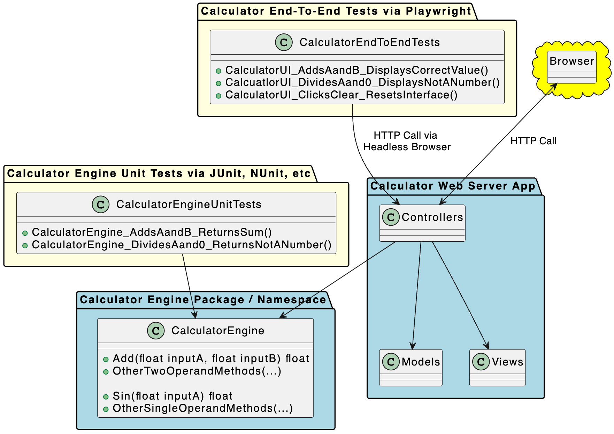
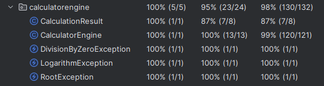

# Introduction
This is a Java 21 web application using Spring MVC, with JUnit for unit testing and Playwright for e2e testing. 
<br/>
This project uses [Spring Initializr](https://start.spring.io/) with the Maven package manager and the Spring Web and Thymeleaf dependencies. Spring Web is useful for building web applications using Spring MVC and Apache Tomcat. Apache Tomcat is a popular option among Java developers, and serves as our Java application server in this project. Thymeleaf is also helpful, as it is a server-side Java template engine for web and standalone environments.


#### Table of Contents
- [Team Members](#team-members)
- [Architecture](#architecture)
- [Development Environment](#development-environment)
- [Executing the Web Application](#executing-the-web-application)
- [Executing Unit Test](#executing-the-unit-tests)
- [Reviewing Unit Test Coverage](#reviewing-unit-test-coverage)
- [Executing End-To-End Tests](#executing-end-to-end-tests)
- [Final Video Presentation](#final-video-presentation)


## Team Members
- [Trey Morris](https://github.com/TreyBMorris)

## Architecture
This project is split into 3 sections. The tests, the web application, and the calculator engine. To cover these sections briefly, the tests section contains both the unit tests and the end-to-end tests using JUnit and Playwright respectively. The Calculator engine is where all the logic for the calculator lies, such as the basic arithmetic, trigonometric functions, and other functions for our calculator. The web application, in the Model View Controller pattern, contains our UI and the controller calls our calculator engine directly for the calculator logic. All of the operations are implemented into the UI on the web server app, through the Calculator engine logic. The architecture diagram below shows the implementation of the calculator, with the calculator engine, tests, e2e tests, and calculator web app being seperate.


## Development Environment
This project was created in a Windows environment, using JetBrain's IntelliJ. I HIGHLY recommend using IntelliJ and Windows for the ideal runtime experience, but IntelliJ and this project should be available on all platforms such as Windows, Mac OS X, and Linux.

To prepare your environment to execute this application:
1. [Install the latest Java runtime for your system.](https://www.java.com/en/download/manual.jsp)
2. [Install Apache Maven](https://maven.apache.org/install.html) PLEASE FOLLOW ALL INSTRUCTIONS. If Apache Maven is not set up correctly, you will be unable to use the maven CLI and you would not be able to run the program from outside the IDE.
4. [Install IntelliJ(Optional)](https://www.jetbrains.com/idea/?var=1)
5. Clone the GitHub repository. Using the command-line interface you can run,
```bash
git clone <repository_url>
```
If you are not using the command-line interface, go to the top of the repository page and click the blue "<> Code" button, and click either GitHub desktop if you have it install or download as a ZIP file.

5. Configure dependencies. Check the "pom.xml" file for dependencies that are required for this project. Maven will automatically download and install these dependencies during the build process.
6. Run the following,
```bash
mvn compile
```

This will compile and build the program in order for you to run it. If you can, I highly suggest using an IDE to run the program, but you can run it from the maven command line as well.
## Executing the Web Application
1. Follow the prerequisites above in the Development Environment section, to make sure you have everything you need for the program to run correctly.
2. Navigate to the directory of the project.
3. Run the following command to run the web application.
```bash
mvn spring-boot:run
```


4. After running the command, the terminal should look something like this,
```bash
  .   ____          _            __ _ _
 /\\ / ___'_ __ _ _(_)_ __  __ _ \ \ \ \
( ( )\___ | '_ | '_| | '_ \/ _` | \ \ \ \
 \\/  ___)| |_)| | | | | || (_| |  ) ) ) )
  '  |____| .__|_| |_|_| |_\__, | / / / /
 =========|_|==============|___/=/_/_/_/
 :: Spring Boot ::                (vX.x.x)

 swe3643.project.CalculatorApplication    : Starting CalculatorApplication using Java 21.0.1 with PID #####
 swe3643.project.CalculatorApplication    : No active profile set, falling back to 1 default profile: "default"
 o.s.b.w.embedded.tomcat.TomcatWebServer  : Tomcat initialized with port 8080 (http)
 o.apache.catalina.core.StandardService   : Starting service [Tomcat]
 o.apache.catalina.core.StandardEngine    : Starting Servlet engine: [Apache Tomcat/10.1.18]
 o.a.c.c.C.[Tomcat].[localhost].[/]       : Initializing Spring embedded WebApplicationContext
 w.s.c.ServletWebServerApplicationContext : Root WebApplicationContext: initialization completed in 918 ms
 o.s.b.a.w.s.WelcomePageHandlerMapping    : Adding welcome page: class path resource [static/index.html]
 o.s.b.w.embedded.tomcat.TomcatWebServer  : Tomcat started on port 8080 (http) with context path ''
 swe3643.project.CalculatorApplication    : Started CalculatorApplication in 1.77 seconds (process running for 2.41)
```

5. Launch your web browser and navigate to "http://localhost:8080/calculator", if you navigate to just "http://localhost:8080" please click the "Calculator" link.
6. Interact with the application in your browser.
7. Shutdown the server. When you are finished, please close your browser press Control+C twice to stop the web server.
## Executing the Unit Tests
1. You will need to run the web server first to run the tests, not running the web server will cause it to fail. Both Unit tests and E2E tests run at the same time when running the next step.
2. Run the following command to run all of the unit tests,
```bash
mvn test
```

3. Review the Results. You should see that all 19 tests run and pass.
4. Re-run tests (if needed). If any tests fail, review the code and test cases to identify the failure. All tests should pass first try, but if they do not, feel free to submit an issue within the GitHub repository.
## Reviewing Unit Test Coverage
1. For this application, I was able to achieve 100% coverage for the Calculator Engine class. I was able to cover all methods within the class, and 99% of lines in the class were covered by my tests.

## Executing End-to-End Tests
1. Run the web application on your local machine, the tests will fail if the web application is not running. 
2. After, run the following command to run the end-to-end tests,
```bash
mvn test
```

3. Under "Running CalculatorE2ETests" you will see that all 5 tests run and pass. 
## Final Video Presentation 

## Troubleshooting
1. If you are having any problems, make sure you delete the target folder in the directory if it is there. I had some issues with running the maven command line commands when this was here. 
2. Another thing I noticed personally, was when I would run "mvn clean" it would end up breaking things. So don't run it.
3. If you cannot get it working from the maven command line, I highly suggest either using IntelliJ or running the application in IntelliJ first. It is ALOT easier to run this program within IntelliJ.
4. If you are running the application from the command line and after trying to run the "mvn compile" or "mvn spring-boot:run" you may get a main class not found error. If this happens, a solution I found was again running it in IntelliJ first. I am unsure why this fixes it, but it seems to work and you should be able to use the command line after running it once in IntelliJ.
<br/>
If there are any other issues or problems, feel free to open an issue for me, and I will make sure it is dealt with!
